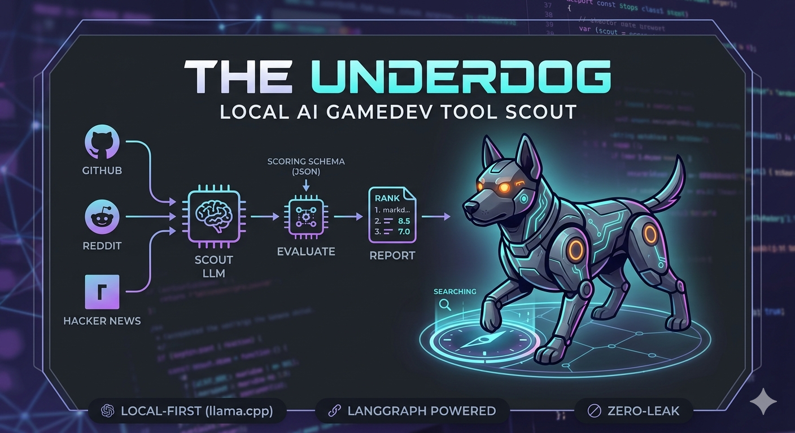

# 🐕 The Underdog

<p align="center">
  
</p>

A local agent that hunts for AI-powered game development tools and news.
It scouts GitHub, Reddit, and Hacker News, evaluates candidates for
novelty / gamedev-relevance / credibility, and produces a ranked
markdown report — all driven by a local `llama-server` instance, so
nothing leaves your machine.

The underlying workflow is a [LangGraph](https://langchain-ai.github.io/langgraph/)
state machine with a ReAct-style tool-calling loop.

---

## 🧠 Architecture

The agent is built as a LangGraph state machine, utilizing a ReAct-style loop to ensure exhaustive searching before moving to high-fidelity evaluation.

graph TD
    Start((START)) --> Scout[Scout LLM]
    Scout -->|tool_calls| Tools[Tool Executor]
    Tools --> Scout
    Scout -->|no tool_calls| Collect[Collect & Dedupe]
    Collect --> Eval[Evaluate & Score]
    Eval --> Report[Markdown Report]
    Report --> End((END))

    style Scout fill:#f9f,stroke:#333,stroke-width:2px
    style Eval fill:#bbf,stroke:#333,stroke-width:2px


```
      ┌───────┐   tool_calls    ┌───────┐
      │ scout │ ─────────────▶ │ tools │
      │  LLM  │ ◀───────────── │       │
      └───┬───┘                └───────┘
          │ no tool_calls
          ▼
      ┌─────────┐   ┌──────────┐   ┌────────┐
      │ collect │ ▶ │ evaluate │ ▶ │ report │ ▶ END
      └─────────┘   └──────────┘   └────────┘
```

- **scout** — LLM bound to the search tools. Plans 3–5 focused searches
  across different sources, then stops.
- **tools** — LangGraph `ToolNode` that dispatches the tool calls.
- **collect** — walks the `ToolMessage`s, parses their JSON payloads,
  dedupes by URL. The LLM never has to hand-summarize results, which
  keeps small/local models on the rails.
- **evaluate** — reprompts the LLM with a strict JSON schema to score
  each candidate on novelty, gamedev-relevance, and credibility
  (0–10). Keeps only items with `score ≥ 6`.
- **report** — renders a markdown report sorted by score.

---

## Requirements

- Python 3.10+
- A running `llama-server` exposing the OpenAI-compatible API at
  `http://localhost:8080/v1`
- A tool-calling capable model loaded in it (default: `qwen3.6-35b-a3b`)

### Starting llama-server

Launch the server with the Jinja chat-template flag so tool-calls are
parsed correctly:

```bash
llama-server \
  -m /path/to/qwen3.6-35b-a3b.gguf \
  --host 0.0.0.0 --port 8080 \
  --jinja \
  -c 16384
```

---

## Install

```bash
cd /Users/diego/Desktop/projects/underdog
python -m venv .venv
source .venv/bin/activate
pip install -e .
cp .env.example .env
```

Edit `.env` if your server URL or model name differs:

```ini
LLAMA_SERVER_URL=http://localhost:8080/v1
LLAMA_SERVER_API_KEY=sk-no-key-required
LLAMA_MODEL=qwen3.6-35b-a3b
```

---

## Usage

```bash
# default: writes docs/data/runs/YYYY-MM-DD.json and updates docs/data/index.json
underdog "procedural level generation with LLMs"

# override where the data lives
underdog "AI NPC dialogue" --data-dir docs/data --run-id 2026-04-16-npc

# also dump a standalone markdown report
underdog "generative animation" --save-markdown reports/anim.md

# dry run — no files touched
underdog "..." --no-persist
```

Every run produces two artefacts by default:

- `docs/data/runs/{run-id}.json` — the full run document (topic, model,
  findings with scores and reasoning, stats)
- `docs/data/index.json` — a rolling list of all runs, newest first

These are exactly what the static site under `docs/` consumes. No
database, no server.

---

## Website (GitHub Pages)

The repo ships with a static site in `docs/` that renders every scouted
run into a polished, dark-themed dashboard — no build step, no
dependencies beyond Google Fonts.

### Layout

```
docs/
├── index.html
├── styles.css
├── app.js
├── .nojekyll          # tell GH Pages to serve files as-is
└── data/
    ├── index.json     # list of runs (rewritten by every run)
    └── runs/
        └── YYYY-MM-DD.json
```

### Enable GitHub Pages

1. Push this repo to GitHub.
2. In **Settings → Pages**, set:
   - Source: `Deploy from a branch`
   - Branch: `main` · folder: `/docs`
3. GitHub gives you a URL like `https://<you>.github.io/underdog/`.

### Daily update workflow

```bash
# 1. run the scout (writes into docs/data/ automatically)
underdog "AI game dev tools"

# 2. commit & push — Pages redeploys within ~1 minute
git add docs/data
git commit -m "underdog: scout run $(date -u +%Y-%m-%d)"
git push
```

### What the site shows

- A hero with aggregate stats (total runs, scouted, kept, top score)
- A run switcher (drop-down) for browsing history
- Per-source filter chips (`github`, `reddit/gamedev`, `hackernews`, …)
- Sort by score, signal (stars/points/comments), or title
- Score-tiered cards: the top picks get a gradient border

### Previewing locally

The site is plain static files, but browsers block `fetch()` on
`file://`. Serve it:

```bash
python -m http.server -d docs 8000
# open http://localhost:8000
```

---

## Project layout

```
underdog/
├── pyproject.toml
├── .env.example
├── README.md
├── docs/                 # static site deployed to GitHub Pages
│   ├── index.html
│   ├── styles.css
│   ├── app.js
│   └── data/
│       ├── index.json
│       └── runs/
└── underdog/
    ├── __init__.py
    ├── llm.py            # ChatOpenAI pointed at llama-server
    ├── tools.py          # @tool: search_github, search_reddit, search_hackernews, fetch_url
    ├── state.py          # AgentState TypedDict
    ├── agent.py          # LangGraph build_graph() + prompts
    ├── log.py            # terse per-node Rich logging
    ├── writer.py         # JSON output + rolling index
    └── main.py           # CLI entry point
```

---

## Extending

- **New source** — add an `@tool`-decorated function in `underdog/tools.py`
  that returns `list[dict]` with at least `title`, `url`, `source`, and
  `description`. Append it to `ALL_TOOLS`. The `collect` node will pick
  it up automatically because it dedupes by URL.
- **Different scoring rubric** — edit `EVALUATOR_SYSTEM` in
  `underdog/agent.py`.
- **Change the scout's behavior** — edit `SCOUT_SYSTEM` in the same
  file (search breadth, recency window, stop condition, etc.).
- **Different model** — override `LLAMA_MODEL` in `.env`. Anything
  served by `llama-server` with OpenAI-compatible tool calling will
  work.

---

## Troubleshooting

- **Scout never calls tools / tool_calls always empty.** Make sure
  `llama-server` was started with `--jinja` and the model's chat
  template supports tool calls. Qwen 3 and similar instruct models do;
  base models do not.
- **Graph hits `recursion_limit`.** The scout is looping. Either raise
  `--recursion-limit` or tighten `SCOUT_SYSTEM` to stop sooner.
- **Empty report.** The evaluator couldn't parse the LLM output as
  JSON, or every candidate scored below 6. Inspect by lowering the
  keep threshold in `evaluate()` or printing `state["findings"]`.
- **Rate limits from GitHub / Reddit.** The unauthenticated GitHub
  search API caps at ~10 req/min; Reddit throttles anonymous JSON
  requests. If this bites, add a token via an env var and send it in
  the `Authorization` header from `underdog/tools.py`.
